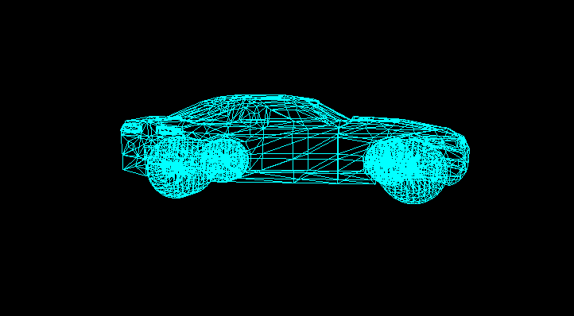

#  CanvasGL - Canvas Like OpenGL

  
 <br/>
A simple C++ OpenGL graphics framework with HTML5 Canvas-like API for easy 2D/3D drawing and OBJ model rendering.

<p align="center">
    
    <br>
    <em>Low Poly Car Model Rendering Using Just 2D Projection</em>
</p>

##  Project Structure

```
canvas_gl/
├── main.cpp         # OpenGL initialization & render loop
├── graphics.h/cpp   # Canvas-like drawing API
├── color.h          # Color system with hex support
├── objloader.h/cpp  # OBJ model loader
├── draw.h/cpp       # User drawing/animation code
├── point.h          # 3D point with transformations
└── 3D_models/*.obj  # 3D models in OBJ format
```
GLTF to OBJ converter - [ImageToStl](https://imagetostl.com/convert/file/gltf/to/obj#convert)

##  Features

###  Graphics API (`graphics.h`)

Simplified drawing functions for OpenGL:

```cpp

Graphics  gfx(800, 600);

// Set drawing color
gfx.setColor(1.0f, 0.0f, 0.0f, 1.0f); // RGB + Alpha
gfx.setColor(COLOR_CYAN);             // Using predefined color
gfx.setColor(hex2float("#00ffff"));   // Using HEX

// Draw primitives
gfx.point(0.0f, 0.0f, 5.0f);          // x, y, size
gfx.line(x1, y1, x2, y2);             // Start and end points
gfx.circle(0.0f, 0.0f, 0.3f, true);   // x, y, radius, filled
gfx.rect(x, y, width, height, false); // Rectangle (filled/outline)
gfx.triangle(x1, y1, x2, y2, x3, y3); // Triangle vertices

// Point-based drawing
gfx.point(Point(0.0f, 0.0f));
gfx.line(p1, p2);
gfx.line_loop(points); // Connect multiple points in a loop
gfx.triangle(p1, p2, p3);
```

  

**Coordinate System:**

-  OpenGL normalized device coordinates: `[-1, 1]` for both X and Y

-  `(0, 0)` is the center of the viewport

-  `+X` is right, `+Y` is up, `+Z` is forward

---  

###  Color System (`color.h`)

  

Easy color management with hex-to-float conversion:

  

```cpp
// Create custom colors
Color  myColor(1.0f, 0.5f, 0.2f); // RGB
Color  transparent(1.0f, 0.0f, 0.0f, 0.5f); // RGBA

// Hex color support
Color  custom  =  hex2float("#FF6B35", 1.0f);

// Predefined colors & variants
COLOR_WHITE, COLOR_BLACK, COLOR_RED, COLOR_GREEN, COLOR_BLUE
COLOR_LIME_GREEN,COLOR_NAVY_BLUE,.....etc
```

---  

###  OBJ Model Loader (`objloader.h`)

Load and render Wavefront OBJ 3D models:

```cpp
// Load model
OBJModel  model  = OBJLoader::loadOBJ("model.obj");

// Access data
std::vector<Point>  vertices  =  model.vertices;      // All 3D vertices
std::vector<std::vector<int>>  edges  =  model.edges; // Edge connectivity
std::vector<std::vector<int>>  faces  =  model.faces; // Face data

// Normalization
// - Centers model at origin
// - Scales to fit viewport
// - Maintains aspect ratio
```

  

**Current OBJ Format Support (to be extended):**

```
v -0.5 0.5 0.25 # Vertex
vn 0.0 1.0 0.0 # Normal (parsed but not used)
vt 0.5 0.5 # Texture coordinate (parsed but not used)
f 1/1/1 2/2/2 3/3/3 # Face (vertex/texture/normal)
f 1//1 2//2 3//3 # Face (vertex//normal)
f 1/1 2/2 3/3 # Face (vertex/texture)
f 1 2 3 # Face (vertex only)
```

--- 

##  Dependencies

-  **GLFW3** - Window and input handling
-  **GLAD** - OpenGL function loader
-  **C++17** or higher
-  **Visual Studio**

Installation Guide - [OpenGL Installation](https://drive.google.com/drive/folders/11aHB03f4RngRlkmFphpRoZ7GN4SEU74z)


..........tbc